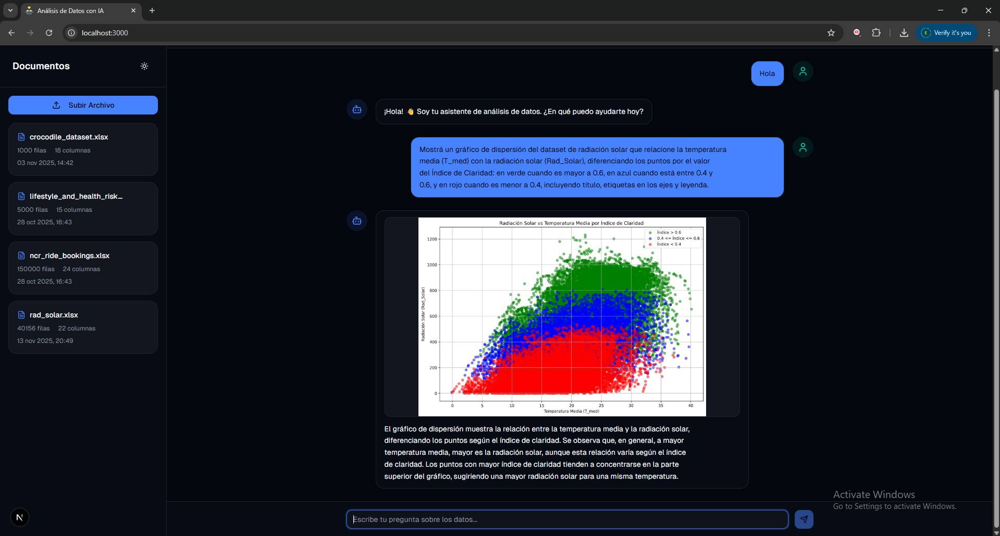
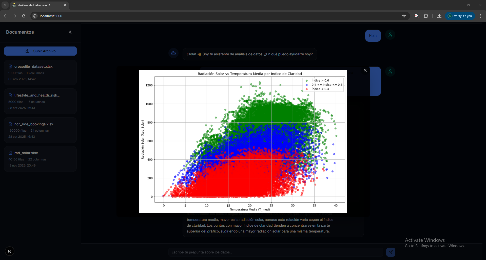
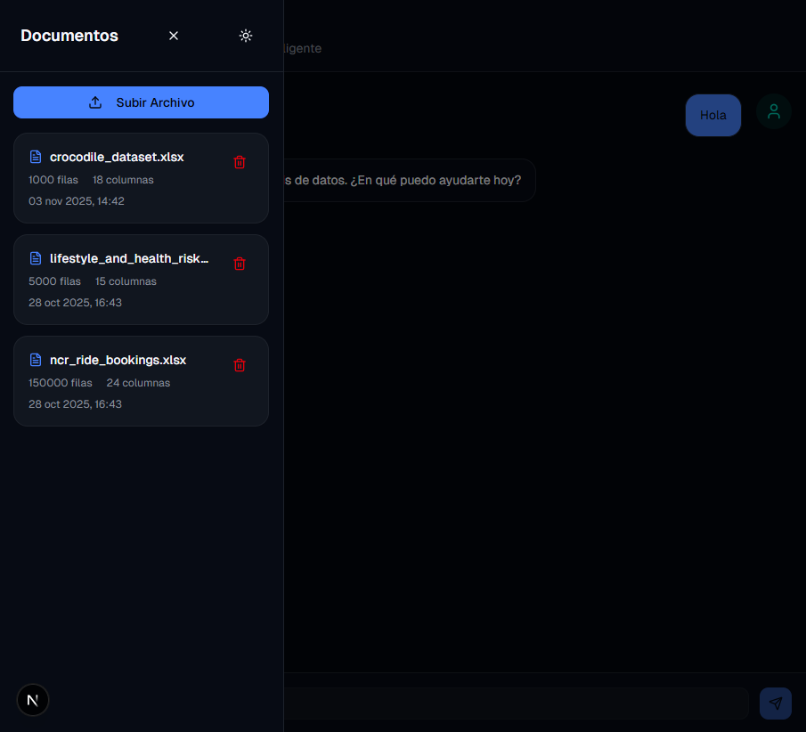
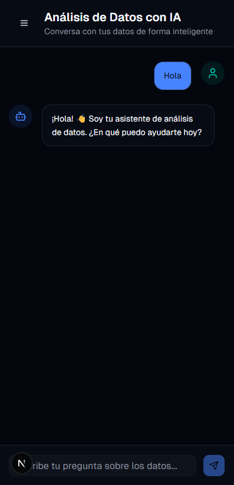

# EDAI - AI-Assisted Data Explorer (Frontend)

[](https://nextjs.org/)
[](https://reactjs.org/)
[](https://www.typescriptlang.org/)
[](https://tailwindcss.com/)

> **⚠️ Important Note:** This repository contains only the **frontend** of the EDAI project. For the complete system functionality, you also need to set up the **backend**, available at: [EDAI Backend Repository](https://github.com/FernandoBlancoTFL/edai-llm-backend)

---

## 📸 Screenshots

### Generated data visualization


### Visualization zoom


### Tablet view


### Mobile view
<div align="center">



</div>

---

## 📋 Description

**EDAI Frontend** is the interactive user interface for the AI-Assisted Data Explorer platform. Built with modern web technologies, it provides an intuitive and responsive chat-based interface that allows users to analyze data through natural language conversations with AI.

The frontend connects seamlessly with the EDAI backend to deliver a complete data analysis experience, featuring real-time chat interactions, automatic graph visualizations, document management, and conversational memory.

---

## 🎯 Key Features

- ✅ **Conversational chat interface**: Natural language interaction with AI agents
- ✅ **Real-time visualizations**: Automatic display of generated plots and graphs
- ✅ **Document management**: Upload, view and delete CSV/Excel files
- ✅ **Responsive design**: Fully adaptive interface for desktop, tablet and mobile devices
- ✅ **Light/Dark theme**: Toggle between visual modes for comfortable viewing
- ✅ **Chat history**: Persistent conversation history across sessions
- ✅ **Typewriter effect**: Smooth text animation for AI responses
- ✅ **Image zoom modal**: Click to enlarge generated visualizations
- ✅ **Auto-scroll**: Automatic scrolling to latest messages
- ✅ **Loading states**: Clear visual feedback during operations
- ✅ **Toast notifications**: User-friendly success/error messages

---

## 🏗️ Project Structure

### General Structure

```
EDAI-Frontend/
├── app/                          # Next.js App Router
│   ├── globals.css              # Global styles and Tailwind imports
│   ├── layout.tsx               # Root layout with theme provider
│   └── page.tsx                 # Main chat page component
│
├── components/                   # Reusable React components
│   ├── ui/                      # shadcn/ui component library
│   │   ├── button.tsx
│   │   ├── card.tsx
│   │   ├── input.tsx
│   │   ├── scroll-area.tsx
│   │   ├── table.tsx
│   │   ├── toaster.tsx
│   │   └── ...
│   ├── chat-message.tsx         # Individual message component
│   ├── image-modal.tsx          # Full-screen image viewer
│   ├── sidebar.tsx              # Document management sidebar
│   └── theme-toggle.tsx         # Light/dark mode switcher
│
├── hooks/                        # Custom React hooks
│   ├── use-toast.ts             # Toast notification hook
│   └── use-typewriter.ts        # Typewriter animation hook
│
├── lib/                          # Utility libraries
│   ├── api.ts                   # API client for backend communication
│   └── utils.ts                 # Helper functions
│
├── public/                       # Static assets
├── .env.local                    # Environment variables (not tracked)
├── .env.example                  # Environment variables template
├── next.config.js               # Next.js configuration
├── tailwind.config.ts           # Tailwind CSS configuration
├── tsconfig.json                # TypeScript configuration
├── package.json                 # Dependencies and scripts
└── README.md                    # This file
```

---

## 🛠️ Technologies Used

### Core Framework
- **Next.js 14**: React framework with App Router and SSR
- **React 18**: UI library with hooks and modern patterns
- **TypeScript 5**: Static typing for improved code quality

### Styling
- **Tailwind CSS 3**: Utility-first CSS framework
- **shadcn/ui**: High-quality accessible component library
- **next-themes**: Dark/light theme management

### UI Components & Libraries
- **Lucide React**: Icon library
- **React Markdown**: Markdown rendering with GFM support
- **SweetAlert2**: Beautiful alert modals

### API Communication
- **Fetch API**: HTTP requests to backend
- **Custom API Client**: Abstraction layer for backend endpoints

---

## 🚀 Installation and Configuration

### Prerequisites

- Node.js 18+ and npm/pnpm
- EDAI Backend running (see [backend repository](https://github.com/FernandoBlancoTFL/EDALLM_langGraph))

### 1. Clone the Repository

```bash
git clone https://github.com/FernandoBlancoTFL/EDALLM_frontend.git
cd EDALLM_frontend
```

### 2. Install Dependencies

```bash
npm install
# or
pnpm install
```

### 3. Configure Environment Variables

The project includes a `.env.example` file as a template. Copy it and rename it to `.env.local`, then fill in your configuration values:

```bash
# Copy the example file
cp .env.example .env.local
```

Edit the `.env.local` file with your backend URL:

```env
NEXT_PUBLIC_API_URL=http://localhost:8000
```

**Note**: The `NEXT_PUBLIC_` prefix is required for environment variables accessible in the browser.

### 4. Run Development Server

```bash
npm run dev
# or
pnpm dev
```

The frontend will be available at: `http://localhost:3000`

### 5. Build for Production

```bash
npm run build
npm start
# or
pnpm build
pnpm start
```

---

## 📖 User Guide

### 1. Initial Setup

1. **Start the backend server** first (see backend repository)
2. **Launch the frontend** development server
3. **Open your browser** at `http://localhost:3000`

### 2. Document Management

#### Upload Documents
1. Click **"Subir Archivo"** (Upload File) button in the sidebar
2. Select a **CSV** or **Excel** file (.csv, .xlsx, .xls)
3. Wait for the success confirmation toast
4. The document will appear in the sidebar with metadata

#### Delete Documents
1. Hover over a document card in the sidebar
2. Click the **trash icon** that appears
3. Confirm deletion in the modal dialog

### 3. Chat Interactions

#### Making Queries
Type your question in the input field at the bottom and press **Enter** or click the **Send** button.

**Examples:**
```
- "Show me the first 5 rows"
- "What are the columns in this dataset?"
- "Calculate the average of Booking Value"
- "Generate a histogram of Trip Distance"
```

#### Viewing Responses
- **Text responses**: Displayed with Markdown formatting and typewriter effect
- **Tables**: Formatted data tables with scrollable columns
- **Graphs**: Clickable images that open in full-screen modal

### 4. Interface Features

#### Theme Toggle
- Click the **moon/sun icon** in the sidebar header
- Switch between light and dark modes
- Preference is saved in browser storage

#### Auto-scroll
- Chat automatically scrolls to new messages
- Manual scroll up shows a **"Scroll to Bottom"** button
- Click to return to the latest message

#### Responsive Design
- **Desktop**: Full sidebar and chat layout
- **Tablet/Mobile**: Collapsible sidebar with overlay
- Click hamburger menu to toggle sidebar on small screens

---

## 🔌 API Integration

### API Client (`lib/api.ts`)

The frontend communicates with the backend through a centralized API client:

```typescript
export const apiClient = {
  // Send chat message
  chat: (message: string) => 
    fetch(`${API_URL}/api/chat`, { ... }),
  
  // Get chat history
  getChatHistory: () => 
    fetch(`${API_URL}/api/chat/chat-history`),
  
  // Upload document
  uploadDocument: (file: File) => 
    fetch(`${API_URL}/api/documents/upload`, { ... }),
  
  // Get all documents
  getDocuments: () => 
    fetch(`${API_URL}/api/documents`),
  
  // Delete document
  deleteDocument: (fileId: string) => 
    fetch(`${API_URL}/api/documents/${fileId}`, { ... })
}
```

### Response Handling

The frontend expects responses in this format:

```typescript
// Chat response
{
  response: string,        // AI-generated text
  type: "text" | "table" | "plot",
  data?: {
    rows?: any[],         // Table data
    columns?: string[],   // Column names
    url?: string          // Image URL for plots
  },
  success: boolean,
  iterations: number,
  strategy_used: string
}

// Document list
[{
  file_id: string,
  filename: string,
  row_count: number,
  column_count: number,
  created_at: string
}]

// Chat history
{
  thread_id: string,
  total: number,
  conversations: [{
    checkpoint_id: string,
    query: string,
    llm_response: string,
    response_metadata: {
      type: string,
      data?: any
    },
    timestamp: string
  }]
}
```

---

## 🧪 Development

### Available Scripts

```bash
# Development server with hot reload
npm run dev

# Build for production
npm run build

# Start production server
npm start

# Run linter
npm run lint

# Type checking
npm run type-check
```

### Code Quality

- **TypeScript**: Strict type checking enabled
- **ESLint**: Code linting with Next.js rules
- **Prettier**: Code formatting (if configured)

---

## 👥 Author

**Fernando Jose Blanco**  
📧 fernando.blanco004@gmail.com  
🎓 Computer Engineering - Universidad Nacional Arturo Jauretche (UNAJ)

### Academic Supervision

- **Organizational Tutor**: Prof. Dr. Marcelo Ángel Cappelletti
- **Supervisor Professor**: Prof. Eng. Lucas Maximiliano Olivera
- **Program Coordinator**: Dr. Eng. Morales, Martín

---

## 📄 License

This project was developed as a **Professional Integrative Project (PIP)** at Universidad Nacional Arturo Jauretche (UNAJ) under the Student Research Initiation Scholarship (BIEI) program.

---

<div align="center">

⭐ **If you found this project useful, consider giving it a star on GitHub** ⭐

</div>